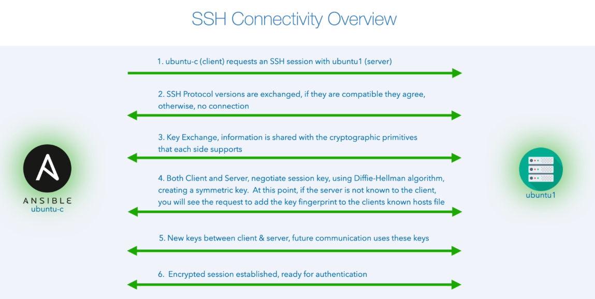
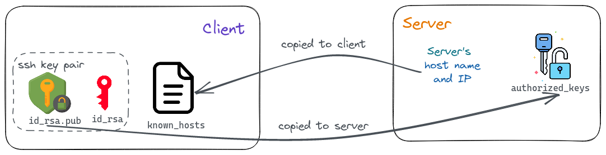

# learn-ansible

## Q&A

  
 1. How does SSH connectivity works ? 

  

The `known_hosts` file lets the client authenticate the server, to check that it isn't connecting to an impersonator. The `authorized_keys` file lets the server authenticate the user.

### Reference

- https://security.stackexchange.com/questions/20706/what-is-the-difference-between-authorized-keys-and-known-hosts-file-for-ssh
- https://www.ssh.com/academy/ssh/public-key-authentication
- https://cryptography.io/en/latest/hazmat/primitives/asymmetric/index.html#asymmetric-algorithms

  

---

---

### Resources

- [Dive Into Ansible - Beginner to Expert in Ansible - DevOps](https://www.udemy.com/course/diveintoansible/)
